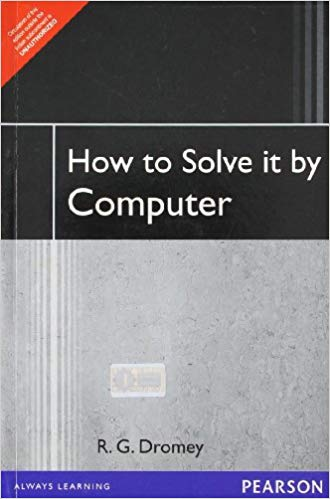

# How To Learn Computer Science

## What is Science ? 

In my understanding its the study of understanding how the world around us works. Computer Science is one such field that is very specific about this modern machine.

## What is Computer Science ? 

Computer Science is all about you tell computers to do what you wanted to acomplish in a way that is understood by the computer which is nothing but program. These programs can be compared to a poetry written in your mother tounge. 

To write poetry you need lots of vernacular skills, here you need set of following skills:

1. Programming Language ( the programming language similar to the vernacular language you need to master before you write poetry).
2. The programming skill ( its the actual skill that you need to develop to write programs, its like a skill you need to develop to write poetry).

## Guidelines

### Edition doesnt matter, rather Addition of knowledge matters.

- Don't worry about the edition like 4th edition or 3rd edition, Only very few books really have additions in new editions other than that its all marketing gymics. You can pick any edition and start learning.

### Approach: Cover To Cover

- Don't leave any chapters for any reason, because you are not studying for any examination rather you are studying for the accumulation of knowledge. 
- Importantly don't be selective in learning like learning the 3rd chapter to 5th chapter omitting 6th chapter and learning 7th chapter to last chapter. Rather be exhaustive in your learning approach. Meaning read everything *Cover To Cover* in a book. Because the author would have written for certainly for number of reasons.

### Workout and Build Your Muscles

- The exercises you are going through is a skill building exercise. To really make that happen you have to build your muscles. 
- Since there is no examination that you have to write, make it as a habit to work out the exercises at the end of every chapter / lessons. 
- Try to do as much exercises as possible
- Apply various techniques, meaning try to write a single program with various techniques like using for loop, using while loops. This will help you understand the real potential power of each tools.
- Try to make your program compact with compromising on quality. Simplicity is the key.
- Readability and maintainability are the key, Because the program that you write should be easily understandable by your friend to improve it, or to add new feature or to fix a bug in your code.

### Read and Write 

- Inculcate the habit of reading others code, especially popular code base on any language, This would speedup your programming skills. You can learn quickly from great experts out there. Explore github.com. Pick a language of your choice and see whats written by great developers. This would certainly quicken your way of learnings. So *Read More code -> Learn -> Write Great Code*

### How to assess yourself 

- Solve the problems behind each chapters, you should be able to solve it without any difficulties. 
- 
## What to Learning and in what order ?

Here is the order in which one has to learn computer science. Not only the order is given and also the importance of each and every subject is highlighted which is normally discarded.

## 1. Programming Fundamentals of a Language 

First you should learn computer programming fundamentals. This is very very important, this is basically to tune your brain into the frame of your thinking in terms of computer science. You would come across lots of new terms in this world. Learn all those right now, otherwise it would be too late and you would never understand other concepts.

Pick any procedural programming language of your choice, It could be C, Pascal, even BASIC is perfectly fine. 

Learn all the fundamentals of Programming 

- What is variable ?
- What is a constant ?
- What is computer memory ?
- How much space of computer memory is required to store a integer, a floating point number, a long integer or a big integer.
- Various operators, Arithmetic operators, Relational operators like `<, >, <=, >=, <>, !=, == `, These are all called binary operator because they take two components to work. There is another special operator `?:` called ternary operator. This takes three operator. Using ternary operator you can create very complex operation in one single line. Here comes logical operator like `AND , OR, NOT, XOR, `. Try to learn what is shortcircuiting of logical operators.
- Learn to use branching of execution, if a conditon is satisfied do these operations otherwise do these operations, there are multiple variants in it. Like 
```
// if then
if then


// if then else
if condition {

} else {
    
}

// elseif 
if condition {
    
} elseif {
    
} 
```

- Another superb way, and easy way of branching is case. When you have lot of conditions to check, and execute a bunch of statement when a particular condition works. Its called case statement.
- Interation : Execute a bunch of statement for n number of time, This is why computers are really used, i.e the real power of computers is this statement. To execute a bunch, or even thousands of lines of code for n number of times. Computers can do it just at a wink of an eye. There are various interation techniques are there. 
```
for loop

while loop 

do while loop

```
- Functions / Modules / Subroutines : 
Another very important to learn is invariablly functions, because functions are the building blocks of huge software. If you consider software as a Table, Legs, Top plate,frames are the building components that makes up the table. Similarly functions are very important. Learning how to use function to take advantage of functions is one of the primary important thing. 

- Memory Referencing / Pointers / Dynamic Memory allocation: 
Manipulating the memory directly, like managing the memory is relatively complex, Like building a linked list dynamically at runtime are very vital fundas that you would be using when you write large systems. For example when you are creating editor yourself, you never know what would be the size of the file your user would open using editor, So you should know to store the file in memory and manage the memory . This is very very important. Perhaps these are key things that would differenciate a mediocer developer and Smart developer. You should consider memory management when you are developing systems by yourself.

- By the end of this you should be able to write/acomplish/solve small to simple programming problems, 

### Good Reads

[How to Solve it By Computers by Dromey](https://www.flipkart.com/solve-computer-1st/p/itmdwkm4rvgewynz?pid=9788131705629&lid=LSTBOK9788131705629VMWFMA&marketplace=FLIPKART&srno=s_1_1&otracker=search&fm=SEARCH&iid=440e6747-dbde-4b6b-9920-71fd8cc8a616.9788131705629.SEARCH&ppt=Homepage&ppn=Homepage&ssid=kh3bc6nz28w8wsgw1538317154229&qH=66302355916593f5)



## 2. Algorithms and Data Structures

Now by now you should have some solid grip of programming. Algorithms and data structures gives everyone an opportunity to explore various techniques of programming.

### Good Reads

[Introduction to Algorithms by Al. Cormen](https://www.flipkart.com/introduction-algorithms-3rd/p/itmdwxyrafdburzg?pid=9788120340077&lid=LSTBOK9788120340077XQBB5U&marketplace=FLIPKART&srno=s_1_4&otracker=AS_Query_OrganicAutoSuggest_0_11&fm=SEARCH&iid=REQ42029b4c826942d5827eeb153664f984_1&ppt=Homepage&ppn=Homepage&ssid=qtln66auggo4kco81538307569534&qH=a4065a25e7f8adb5)

